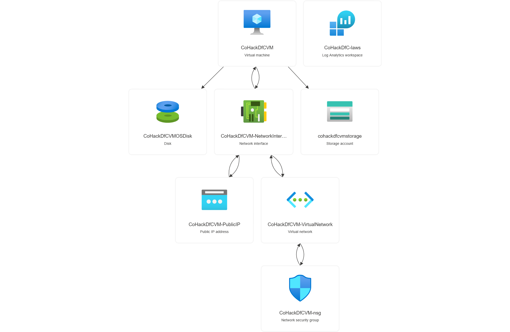

# Azure Defender for Cloud MiniHack

## Overview

This challenge-based Azure Defender for Cloud Hackathon is intended to teach how to enhance the security of your Azure workloads using Defender for Cloud.
During the mini-Open Hack you will be working with Defender for Cloud features such as Secure Score, security recommendations, regulatory compliance, workload protections and alerts.

## Goals

1. Build attendee's technical skills on Defender for Cloud
2. Understand what Defender for Cloud can do to enhance secuity and compliance in your environment

## Provided Setup

Attendees will get access to an Azure Subscription where a prebuilt deployment is ready.  This includes some a VM, a Log Analytics Workspace, some networking resources and a preconfigured Defender for Cloud setup.

## Useful References

- [Quickstart: Enable enhanced security features](https://learn.microsoft.com/en-us/azure/defender-for-cloud/enable-enhanced-security)
- [Security posture for Microsoft Defender for Cloud](https://learn.microsoft.com/en-us/azure/defender-for-cloud/secure-score-security-controls)
- [Tutorial: Improve your regulatory compliance](https://learn.microsoft.com/en-us/azure/defender-for-cloud/regulatory-compliance-dashboard)
- [Secure your management ports with just-in-time access](https://learn.microsoft.com/en-us/azure/defender-for-cloud/just-in-time-access-usage)
- [Manage and respond to security alerts in Microsoft Defender for Cloud](https://learn.microsoft.com/en-us/azure/defender-for-cloud/managing-and-responding-alerts#respond-to-security-alerts)

## Description

- Azure Credentials: The credentials will be handed out during the hack opening session.
- Resource Group: a resource group has been created where you will have a contributor role assigned to you. (Please do not install new resources, only change configuration)
- Log Analytics Workspace: This has already been pre-created to save some time
- Azure virtual machine: This Azure virtual machine is already onboarded to Defender for Cloud. It's probably not configured perfectly from a security perspective. You do not need to sign in to this VM.
- Defender for Cloud service: Defender for Cloud is enabled on your subscription and your VM has been automatically onboarded to send data. You have limited permissions in Defender for Cloud, so you can see the security recommendations for the entire subscription and allresources, but you can only remediate ressoures in your resource group. 

## Success Criteria

### Defender for Cloud Challenges

1. Verify Defender for Server plan is enabled
2. Verify autoprovisioning is enabled and find where the events are going
3. Review security recommendations for your subscription. Which recommendation increses Secre Score the most?
4. Find security recommendations for your sample VM (hint: you can look at the VM directly) and apply a fix for one (e.g., "Machines should be configured to periodically check for missing system updates")
5. Find another recommendation for your sample VM and create an exemption. The exemption should expire after a week.
6. Check regulatory compliance and download a report
7. Find and download the "Azure 2021 - HITRUST Certification Letter"

### Optional Challenges

1. Enable Just-in-Time access for the sample VM
2. Ensure port 3389 is only accessible for 2 hours per request, and only from IP range 10.0.0.0/16
3. Somebody tried to mine Bitcoins in our environment. On which machine did that happen? What was the command line used for that?